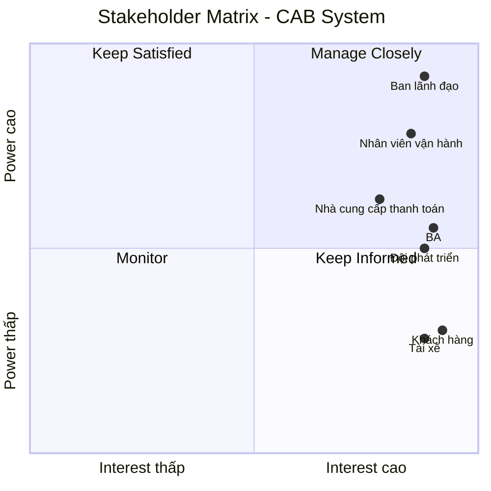
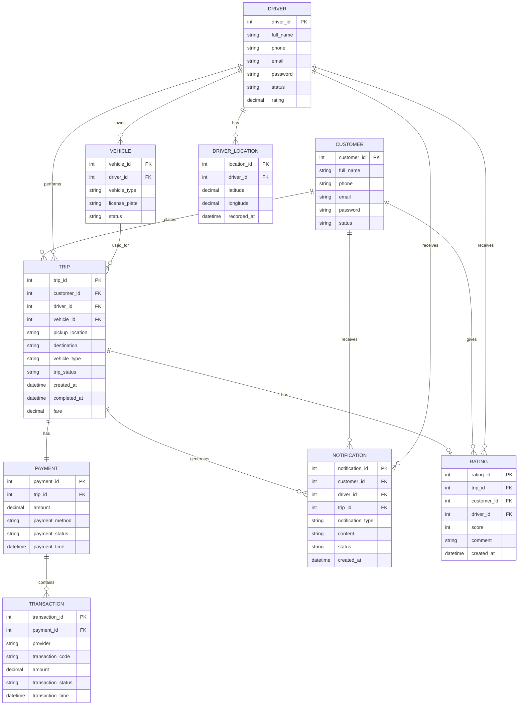
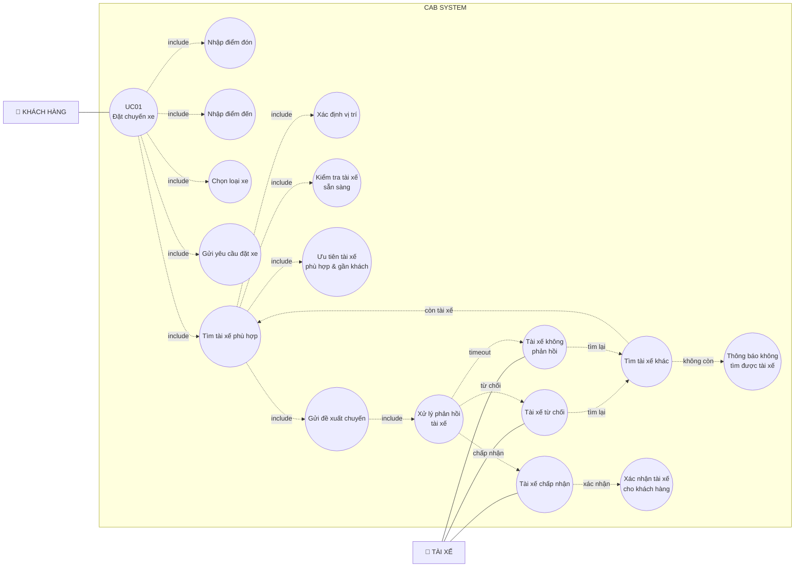

# **B1: Đọc và phân tích yêu cầu sơ khởi của khách hàng ở giai đoạn 1**
-Hiểu được business contect : ngữ cảnh nghiệp vụ -> Xác định vấn đề nghiệp vụ
1. Hiểu Business Context – Ngữ cảnh nghiệp vụ

1.1. Tổng quan doanh nghiệp

Công ty ABC là doanh nghiệp cung cấp dịch vụ đặt xe trực tuyến. Hiện tại khách hàng có thể đặt xe thông qua tổng đài hoặc một ứng dụng đơn giản.

Do hệ thống hiện tại còn nhiều hạn chế, doanh nghiệp muốn xây dựng một CAB System – nền tảng đặt xe mới, có khả năng phục vụ số lượng lớn khách hàng và tài xế, đồng thời có thể mở rộng thêm tính năng trong tương lai. Thời gian xây dựng và triển khai sản phẩm dự kiến là 7 tuần.

1.2. Quy trình nghiệp vụ tổng quát

Có thể hiểu nghiệp vụ chính của CAB System theo chuỗi:

Khách hàng tạo yêu cầu đặt xe
↓
Hệ thống tìm tài xế phù hợp
↓
Tài xế nhận/từ chối chuyến
↓
Khách hàng theo dõi chuyến đi
↓
Tài xế thực hiện chuyến
↓
Hệ thống tính cước
↓
Khách hàng thanh toán
↓
Hệ thống gửi thông báo kết quả
↓
Khách hàng đánh giá tài xế

2. Xác định vấn đề nghiệp vụ – Business Problems

| STT | Vấn đề nghiệp vụ | Nguyên nhân/Hiện trạng | Hệ quả |
|---|---|---|---|
| 1 | Phân công tài xế còn thủ công | Việc phân công tài xế chủ yếu thực hiện thủ công | Khó mở rộng, xử lý chậm |
| 2 | Khách hàng khó theo dõi chuyến | Hệ thống hiện tại chưa hỗ trợ theo dõi trạng thái đầy đủ | Trải nghiệm khách hàng chưa tốt |
| 3 | Thanh toán chưa tập trung | Thông tin thanh toán chưa được quản lý tập trung | Khó quản lý giao dịch |
| 4 | Khó mở rộng hệ thống | Hệ thống hiện tại chưa đáp ứng tốt khi quy mô tăng | Khó phục vụ nhiều khách hàng/tài xế |
| 5 | Tìm tài xế chưa tự động | Chưa có cơ chế tự động lựa chọn và ưu tiên tài xế | Tăng thời gian chờ |
| 6 | Khó xử lý trường hợp tài xế từ chối | Cần tiếp tục tìm tài xế khác | Có thể làm gián đoạn việc đặt xe |
| 7 | Quản lý vận hành còn khó khăn | Nhân viên cần quản lý khách hàng, tài xế, phương tiện, chuyến đi | Khó kiểm soát hoạt động |
| 8 | Khó theo dõi hiệu quả kinh doanh | Ban lãnh đạo cần báo cáo về chuyến, doanh thu, hủy chuyến... | Khó đánh giá hoạt động |

# **B2:**
-Phải xác định những stakeholder

-lập bảng gồm 2 bảng: tên và vai trò

-vẽ một cái ma trận stakeholder matrix sẽ giúp cho biết tầm quan trọng, ảnh hưởng vai trò của hệ thống vẽ bằng công cụ mermaid + markdown
1. Bảng Stakeholder và Vai trò

| Stakeholder | Vai trò |
|---|---|
| Khách hàng | Đăng ký/đăng nhập, đặt xe, theo dõi chuyến, thanh toán, xem lịch sử và đánh giá tài xế |
| Tài xế | Quản lý hồ sơ/phương tiện, nhận hoặc từ chối chuyến, cập nhật trạng thái chuyến và cung cấp vị trí |
| Nhân viên vận hành | Quản lý khách hàng, tài xế, phương tiện, chuyến đi; theo dõi và xử lý các trường hợp phát sinh |
| Ban lãnh đạo | Theo dõi báo cáo, doanh thu, số lượng chuyến, tỷ lệ hoàn thành/hủy và hiệu quả tài xế |
| Nhà cung cấp thanh toán bên ngoài | Xử lý thanh toán điện tử cho hệ thống CAB |
| Đội phát triển hệ thống | Phân tích, thiết kế, xây dựng, triển khai và bảo trì hệ thống |
| Business Analyst (BA) | Làm rõ yêu cầu, xác định phạm vi, tác nhân, quy trình, business rules, ngoại lệ và các vấn đề chưa rõ |

2. Phân loại Stakeholder

Để sau này dễ chuyển sang Use Case, mình có thể chia như sau:

Nhóm người sử dụng trực tiếp
- Khách hàng
- Tài xế
- Nhân viên vận hành

Nhóm quản lý/ra quyết định
- Ban lãnh đạo
- Nhóm hệ thống bên ngoài
- Nhà cung cấp thanh toán

Nhóm tham gia dự án
- Business Analyst
- Đội phát triển hệ thống

3. Stakeholder Matrix

Với Stakeholder Matrix, đề xuất dùng hai tiêu chí:

- Power (Mức độ ảnh hưởng/quyền quyết định)
- Interest (Mức độ quan tâm đến hệ thống)

Có 4 vùng:
|  | Interest thấp | Interest cao |
|---|---|---|
| Power cao | Keep Satisfied(Duy trì hài lòng) | Manage Closely(Quản lý chặt chẽ) |
| Power thấp | Monitor(Theo dõi) | Keep Informed(Cung cấp thông tin) |

Đánh giá cho CAB System
- Ban lãnh đạo: Power cao + Interest cao → Manage Closely
- Nhân viên vận hành: Power cao/tương đối cao + Interest cao → Manage Closely
- Khách hàng: Power thấp + Interest cao → Keep Informed
- Tài xế: Power thấp + Interest cao → Keep Informed
- Nhà cung cấp thanh toán: Power trung bình + Interest cao → Manage Closely
- BA/Đội phát triển: Power trung bình + Interest cao → Keep Informed / Manage - Closely tùy phạm vi dự án.

4. Mermaid Stakeholder Matrix

# **B3: Xác định mục tiêu nghiệp vụ:**
liệt kê ra vd:

-bg01 giảm thời gian tìm tài xế (là tự động tìm tài xế)

-bg02 cho phép tự thanh toán (cho trả tiền mặt hoặc chuyển tiền)

| Mã | Mục tiêu nghiệp vụ | Diễn giải |
|---|---|---|
| BG01 | Giảm thời gian tìm và phân công tài xế | Tự động tìm tài xế phù hợp dựa trên vị trí, trạng thái sẵn sàng và các tiêu chí vận hành. |
| BG02 | Hỗ trợ thanh toán thuận tiện | Cho phép khách hàng thanh toán bằng tiền mặt hoặc phương thức thanh toán điện tử. |
| BG03 | Nâng cao khả năng theo dõi chuyến đi | Cho phép khách hàng biết trạng thái chuyến, tài xế và thời gian dự kiến tài xế đến. |
| BG04 | Nâng cao hiệu quả quản lý vận hành | Hỗ trợ nhân viên quản lý khách hàng, tài xế, phương tiện và chuyến đi trên một hệ thống tập trung. |
| BG05 | Nâng cao chất lượng dịch vụ | Cho phép khách hàng đánh giá tài xế sau khi hoàn thành chuyến đi. |
| BG06 | Cung cấp dữ liệu phục vụ quản lý | Cung cấp báo cáo về số chuyến, doanh thu, tỷ lệ hoàn thành, tỷ lệ hủy và hiệu quả hoạt động của tài xế. |
| BG07 | Đảm bảo hệ thống có khả năng mở rộng | Cho phép hệ thống phục vụ số lượng lớn khách hàng, tài xế và bổ sung chức năng mới trong tương lai. |

# **B4:Xác định phạm vi yêu cầu làm**
-vd: có quản lí khách hàng, tài xế:

Liệt kê ra các yêu cầu phải làm, các module

Phạm vi không phải/không nên làm

4.1. Các module nằm trong phạm vi

Module 1 – Quản lý tài khoản khách hàng
- Đăng ký tài khoản
- Đăng nhập
- Cập nhật thông tin cá nhân

Module 2 – Đặt xe
- Nhập điểm đón
- Nhập điểm đến
- Lựa chọn loại xe
- Gửi yêu cầu đặt xe
- Theo dõi trạng thái tìm tài xế

Module 3 – Điều phối và tìm tài xế
- Xác định tài xế phù hợp
- Ưu tiên tài xế gần khách hàng
- Gửi yêu cầu đến tài xế
- Xử lý tài xế không phản hồi
- Xử lý tài xế từ chối
- Tiếp tục tìm tài xế khác
- Thông báo khi không tìm được tài xế

Module 4 – Quản lý chuyến đi
- Tài xế nhận chuyến
- Tài xế cập nhật trạng thái chuyến
- Theo dõi trạng thái chuyến
- Lưu thông tin vị trí tài xế
- Hoàn thành chuyến

Module 5 – Quản lý tài xế
- Đăng ký/tạo tài khoản tài xế
- Cập nhật hồ sơ
- Quản lý thông tin phương tiện
- Cập nhật trạng thái hoạt động
- Sẵn sàng nhận chuyến
- Nhận thông báo chuyến mới
- Chấp nhận/từ chối chuyến

Module 6 – Tính cước và thanh toán
- Tính số tiền phải trả
- Thanh toán tiền mặt
- Thanh toán điện tử
- Tích hợp nhà cung cấp thanh toán bên ngoài
- Xử lý thanh toán thất bại
- Tra cứu lịch sử giao dịch

Module 7 – Thông báo
- Thông báo tiếp nhận yêu cầu
- Thông báo tài xế nhận chuyến
- Thông báo tài xế đến điểm đón
- Thông báo hoàn thành chuyến
- Thông báo kết quả thanh toán
- Thông báo cho tài xế về chuyến mới/thay đổi chuyến

Module 8 – Quản trị vận hành
- Quản lý khách hàng
- Quản lý tài xế
- Quản lý phương tiện
- Quản lý chuyến đi
- Theo dõi chuyến đang diễn ra
- Kiểm tra trạng thái tài xế
- Xử lý chuyến bị lỗi
- Tra cứu lịch sử giao dịch
- Phân quyền nhân viên

Module 9 – Báo cáo
- Số lượng chuyến
- Doanh thu
- Tỷ lệ chuyến hoàn thành
- Tỷ lệ hủy
- Hiệu quả hoạt động của tài xế

Module 10 – Đánh giá
- Khách hàng đánh giá tài xế sau chuyến đi.

4.2. Phạm vi không làm / chưa nên làm

**Phần này rất quan trọng vì giúp giới hạn dự án 7 tuần.**

| STT | Ngoài phạm vi / chưa làm |
|---|---|
| 1 | Tự xây dựng hệ thống thanh toán điện tử riêng |
| 2 | Lưu trực tiếp thông tin nhạy cảm của thẻ/tài khoản thanh toán |
| 3 | Xây dựng hệ thống bản đồ/GPS riêng |
| 4 | Tự xây dựng nhà cung cấp thông báo riêng |
| 5 | Tự quyết định công thức tính cước khi khách hàng chưa xác nhận |
| 6 | Tự quyết định tiêu chí ưu tiên tài xế khi chưa được xác nhận |
| 7 | Tự quyết định thời gian tài xế phải phản hồi |
| 8 | Tự quyết định chính sách hủy chuyến |
| 9 | Tự quyết định thời gian lưu trữ dữ liệu |
| 10 | Các loại dịch vụ mới chưa được yêu cầu trong giai đoạn hiện tại |

**Lưu ý:** Những vấn đề từ mục 5–9 không hẳn là "không bao giờ làm", mà chính xác hơn là **chưa thể chốt ở phạm vi hiện tại vì khách hàng yêu cầu BA phải làm rõ trước khi phát triển.**

# **B5: xong b4 gặp khách hàng xác nhận lại -> bước qua b5**
-Chuyển yêu cầu thành business requirement (br)

-Bảng 3 cột (stt,br, tên br, diễn giải)

Br01? Đặt chuyến xe:hệ thống cho phép khách hàng tạo yêu cầu, cung cấp điểm đến điểm đi của khách hàng

Br02?

Br03?

**B5. Bảng Business Requirements**
| STT | Mã BR | Tên BR | Diễn giải |
|---|---|---|---|
| 1 | BR01 | Đặt chuyến xe | Hệ thống cho phép khách hàng tạo yêu cầu đặt xe bằng cách cung cấp điểm đón, điểm đến và loại xe. |
| 2 | BR02 | Tìm và phân công tài xế | Hệ thống tự động xác định và lựa chọn tài xế phù hợp dựa trên vị trí, trạng thái sẵn sàng và các tiêu chí vận hành. |
| 3 | BR03 | Xử lý phản hồi của tài xế | Hệ thống cho phép xử lý trường hợp tài xế không phản hồi hoặc từ chối chuyến và tiếp tục tìm tài xế khác. |
| 4 | BR04 | Theo dõi chuyến đi | Hệ thống cho phép khách hàng theo dõi tài xế, thời gian dự kiến đến và trạng thái hiện tại của chuyến đi. |
| 5 | BR05 | Quản lý thực hiện chuyến | Hệ thống cho phép tài xế cập nhật các trạng thái của chuyến từ khi đến điểm đón, đón khách, đang di chuyển đến khi hoàn thành. |
| 6 | BR06 | Quản lý vị trí tài xế | Hệ thống lưu thông tin vị trí của tài xế để hỗ trợ tìm tài xế gần khách hàng và dự kiến thời gian đến. |
| 7 | BR07 | Tính cước chuyến đi | Hệ thống xác định số tiền khách hàng phải trả dựa trên loại dịch vụ và thông tin chuyến đi. |
| 8 | BR08 | Thanh toán chuyến đi | Hệ thống hỗ trợ khách hàng thanh toán bằng tiền mặt hoặc phương thức thanh toán điện tử. |
| 9 | BR09 | Xử lý thanh toán điện tử | Hệ thống tích hợp với nhà cung cấp thanh toán bên ngoài và xử lý trường hợp giao dịch thất bại theo chính sách của doanh nghiệp. |
| 10 | BR10 | Quản lý thông báo | Hệ thống gửi thông báo cho khách hàng và tài xế về các sự kiện quan trọng liên quan đến đặt xe, chuyến đi và thanh toán. |
| 11 | BR11 | Quản lý khách hàng | Hệ thống cho phép quản lý tài khoản và thông tin khách hàng. |
| 12 | BR12 | Quản lý tài xế và phương tiện | Hệ thống cho phép quản lý hồ sơ tài xế, thông tin phương tiện và trạng thái hoạt động của tài xế. |
| 13 | BR13 | Quản lý chuyến đi | Hệ thống cho phép nhân viên vận hành theo dõi chuyến đang diễn ra, trạng thái tài xế và xử lý các trường hợp chuyến bị lỗi. |
| 14 | BR14 | Quản lý giao dịch | Hệ thống lưu trữ và cho phép tra cứu lịch sử giao dịch phục vụ hoạt động vận hành. |
| 15 | BR15 | Phân quyền quản trị | Hệ thống kiểm soát quyền truy cập để nhân viên chỉ được thực hiện các thao tác phù hợp với quyền được cấp. |
| 16 | BR16 | Đánh giá tài xế | Hệ thống cho phép khách hàng đánh giá tài xế sau khi chuyến đi hoàn thành. |
| 17 | BR17 | Báo cáo hoạt động | Hệ thống cung cấp báo cáo về số lượng chuyến, doanh thu, tỷ lệ hoàn thành, tỷ lệ hủy và hiệu quả hoạt động của tài xế. |
| 18 | BR18 | Quản lý lịch sử chuyến đi | Hệ thống cho phép khách hàng xem lại lịch sử các chuyến đi và số tiền phải trả. |

# **B6: xây dựng các business process:**
-Vd: khách hàng muốn đặt chuyến :tạo chuyến đi – xác nhận điểm đón/điểm đến –hệ thống xác nhận –tìm tài xế ->tài xế chấp nhận hay ko thì phải báo cho khách hàng

-Tạo các business process

**BP01 – Đặt chuyến và tìm tài xế**

**Mục tiêu:** Khách hàng tạo chuyến và hệ thống tự động tìm tài xế phù hợp.

**Quy trình:**
Khách hàng tạo yêu cầu đặt xe
- Nhập điểm đón và điểm đến
- Chọn loại xe
- Hệ thống xác nhận yêu cầu
- Hệ thống tìm tài xế phù hợp
- Gửi yêu cầu cho tài xế
- Tài xế **chấp nhận / từ chối / không phản hồi**
- Nếu chấp nhận → Xác nhận tài xế cho khách hàng
- Nếu từ chối/không phản hồi → Tìm tài xế khác
- Nếu không tìm được → Thông báo cho khách hàng

Đây là **process** quan trọng nhất của hệ thống vì liên quan trực tiếp đến BG01 và BR01–BR03. Yêu cầu khách hàng cũng nêu rõ hệ thống phải tiếp tục tìm tài xế khác nếu tài xế đầu tiên từ chối hoặc không phản hồi.

**BP02 – Thực hiện và theo dõi chuyến đi**

**Mục tiêu:** Quản lý toàn bộ trạng thái chuyến sau khi tài xế nhận chuyến.

**Quy trình:**
Tài xế chấp nhận chuyến
- Hệ thống thông báo cho khách hàng
- Tài xế di chuyển đến điểm đón
- Tài xế cập nhật **Đã đến điểm đón**
- Khách hàng nhận thông báo
- Tài xế cập nhật **Đã đón khách**
- Tài xế cập nhật **Đang di chuyển**
- Tài xế cập nhật **Hoàn thành chuyến**
- Hệ thống thông báo chuyến đã hoàn thành

Trong quá trình này, hệ thống đồng thời lưu thông tin vị trí tài xế để hỗ trợ tìm tài xế và dự kiến thời gian đến.

**BP03 – Tính cước và thanh toán**

**Mục tiêu:** Xác định số tiền khách hàng phải trả và xử lý thanh toán.

**Quy trình:**
Chuyến đi hoàn thành
- Hệ thống xác định số tiền phải trả
- Khách hàng chọn phương thức thanh toán
- **Tiền mặt** → Xác nhận thanh toán
**HOẶC**
- **Thanh toán điện tử** → Gửi giao dịch đến nhà cung cấp thanh toán
- Nhà cung cấp trả kết quả
-  Thanh toán thành công → Ghi nhận giao dịch
- Thanh toán thất bại → Thông báo khách hàng → Xử lý lại theo chính sách

Điểm quan trọng là hệ thống **không lưu trực tiếp thông tin nhạy cảm của thẻ/tài khoản**, mà tích hợp với nhà cung cấp thanh toán bên ngoài.

**BP04 – Thông báo trạng thái**

**Mục tiêu:** Đảm bảo khách hàng và tài xế nhận được thông tin kịp thời.

**Quy trình:**
Có sự kiện trong hệ thống
→ Xác định người nhận
→ Tạo thông báo
→ Gửi thông báo
→ Người dùng nhận thông báo

Các sự kiện chính:
- Yêu cầu đặt xe được tiếp nhận
- Tài xế nhận chuyến
- Tài xế đến điểm đón
- Chuyến hoàn thành
- Thanh toán thành công/thất bại
- Tài xế nhận chuyến mới
- Có thay đổi liên quan đến chuyến đang thực hiện

Yêu cầu khách hàng cũng muốn kiến trúc thông báo có thể mở rộng thêm các kênh trong tương lai.

**BP05 – Quản lý vận hành**

**Mục tiêu:** Giúp nhân viên vận hành kiểm soát hoạt động của hệ thống.

**Quy trình:**
Nhân viên đăng nhập hệ thống quản trị
- Kiểm tra các chuyến đang diễn ra
- Kiểm tra trạng thái tài xế
- Quản lý khách hàng / tài xế / phương tiện
- Phát hiện chuyến có vấn đề
- Xử lý trường hợp lỗi
- Tra cứu lịch sử giao dịch
- Ghi nhận kết quả xử lý

Ngoài ra, các thao tác quản trị nhạy cảm phải được kiểm soát bằng **phân quyền**.

**BP06 – Kết thúc chuyến và đánh giá**

**Mục tiêu:** Hoàn tất quy trình dịch vụ sau khi chuyến đi kết thúc.

**Quy trình:**
Chuyến đi hoàn thành
- Xác nhận số tiền phải trả
- Hoàn tất thanh toán
- Lưu lịch sử chuyến đi
- Khách hàng xem thông tin chuyến
- Khách hàng đánh giá tài xế
- Hệ thống lưu đánh giá

Khách hàng được yêu cầu có thể xem lịch sử chuyến đi, số tiền phải trả và đánh giá tài xế sau khi hoàn thành chuyến.

# **B7: Phân rã yêu cầu nghiệp vụ (fr)**
Từ br -> phân rã ? fr

Fr01: xác định vị trí khách hàng

Fr02: chọn những tài xế có trạng thái online trong khu vực

Fr03: chọn loại xe

Fr04: nếu có yêu cầu ưu tiên cho tài xế rating cao: fr -> ưu tiên cho tài xế có đánh giá cao

| BR | Tên BR | Các FR chính |
|---|---|---|
| BR01 | Đặt chuyến xe | FR01 Nhập điểm đón; FR02 Nhập điểm đến; FR03 Chọn loại xe; FR04 Gửi yêu cầu |
| BR02 | Tìm và phân công tài xế | FR05 Xác định vị trí; FR06 Lọc tài xế sẵn sàng; FR07 Xác định tài xế phù hợp; FR08 Ưu tiên tài xế gần khách; FR09 Gửi yêu cầu cho tài xế |
| BR03 | Xử lý phản hồi tài xế | FR10 Chấp nhận; FR11 Từ chối; FR12 Xử lý không phản hồi; FR13 Tìm tài xế khác |
| BR04 | Theo dõi chuyến | FR14 Xem tài xế; FR15 Xem ETA; FR16 Xem trạng thái chuyến |
| BR05 | Thực hiện chuyến | FR17 Đã đến; FR18 Đã đón; FR19 Đang di chuyển; FR20 Hoàn thành |
| BR07 | Tính cước | FR21 Xác định cước; FR22 Hiển thị số tiền |
| BR08 | Thanh toán | FR23 Tiền mặt; FR24 Thanh toán điện tử; FR25 Xử lý thất bại |
| BR10 | Thông báo | FR26 Thông báo đặt xe; FR27 Thông báo tài xế; FR28 Thông báo chuyến; FR29 Thông báo thanh toán |
| BR11/12 | Quản lý người dùng | FR30 Quản lý khách hàng; FR31 Quản lý tài xế; FR32 Quản lý phương tiện |
| BR13/14/15 | Quản lý vận hành | FR33 Theo dõi chuyến; FR34 Xử lý lỗi; FR35 Tra cứu giao dịch; FR36 Phân quyền |
| BR16/17/18 | Đánh giá & báo cáo | FR37 Đánh giá tài xế; FR38 Lịch sử chuyến; FR39 Báo cáo hoạt động |

# **B8: business rule and acception (những cái luật để khi xuất hiện những trường hợp ngoại lệ là xử lí như thế nào?)**
Ví dụ: 
-Chỉ những tài xế nào trong trạng thái sẵn sàng thì mới được nhận chuyến…

-Giả sử khách hàng tạo chuyến – chờ tìm tài xế - thời gian lâu quá -> xử lí sao? (hủy)

-Giả sử khách hàng tạo chuyến – tài xế nhận chuyến nhưng quá thời hạn tài xế không chấp nhận – hủy chuyến- chuyển sang tài xế khác (nhận chuyến và chấp nhận chuyến khác nhau)

1. Business Rules – Luật nghiệp vụ

| Mã | Business Rule | Quy tắc |
|---|---|---|
| BRL01 | Tài xế được nhận chuyến | Chỉ tài xế có trạng thái sẵn sàng nhận chuyến mới được hệ thống đề xuất chuyến. |
| BRL02 | Tài xế phù hợp | Hệ thống chỉ đề xuất tài xế phù hợp với yêu cầu chuyến và các tiêu chí vận hành. |
| BRL03 | Ưu tiên tài xế | Khi tìm tài xế, hệ thống ưu tiên tài xế **phù hợp và gần khách hàng**. |
| BRL04 | Một tài xế – một chuyến | Tài xế đã nhận một chuyến đang thực hiện thì không được đồng thời nhận chuyến khác. |
| BRL05 | Tài xế từ chối | Nếu tài xế từ chối chuyến, hệ thống phải tiếp tục tìm tài xế khác. |
| BRL06 | Tài xế không phản hồi | Nếu tài xế không phản hồi trong thời gian được doanh nghiệp quy định, hệ thống xử lý như trường hợp không nhận chuyến và tìm tài xế khác. |
| BRL07 | Không tìm được tài xế | Nếu không còn tài xế phù hợp, hệ thống phải thông báo rõ ràng cho khách hàng. |
| BRL08 | Trạng thái chuyến | Chuyến đi phải được cập nhật trạng thái theo quá trình thực hiện: đến điểm đón → đã đón khách → đang di chuyển → hoàn thành. |
| BRL09 | Thanh toán điện tử | Thanh toán điện tử phải được xử lý thông qua nhà cung cấp thanh toán bên ngoài. |
| BRL10 | Dữ liệu thanh toán | Hệ thống CAB không lưu trực tiếp thông tin nhạy cảm của thẻ hoặc tài khoản thanh toán. |
| BRL11 | Đánh giá tài xế | Khách hàng chỉ được đánh giá tài xế sau khi chuyến đi hoàn thành. |
| BRL12 | Phân quyền | Nhân viên chỉ được thực hiện các thao tác quản trị tương ứng với quyền được cấp. |
| BRL13 | Bảo mật | Khách hàng và tài xế phải được xác thực trước khi sử dụng chức năng yêu cầu tài khoản. |
| BRL14 | Lưu vết | Các thao tác quản trị quan trọng phải được lưu vết để phục vụ kiểm tra khi có sự cố. |

2. Exception – Các trường hợp ngoại lệ

| Mã | Exception | Điều kiện | Cách xử lý |
|---|---|---|---|
| EX01 | Không tìm được tài xế | Không có tài xế phù hợp | Thông báo khách hàng |
| EX02 | Tài xế từ chối | Tài xế từ chối chuyến | Tìm tài xế khác |
| EX03 | Tài xế không phản hồi | Hết thời gian phản hồi | Coi như không nhận và tìm tài xế khác |
| EX04 | Tìm tài xế quá lâu | Vượt thời gian chờ quy định | **Cần xác nhận chính sách hủy** |
| EX05 | Tài xế đã nhận nhưng không đến | Vượt thời gian đến điểm đón | **Cần xác nhận cách xử lý** |
| EX06 | Thanh toán thất bại | Nhà cung cấp thanh toán trả kết quả thất bại | Thông báo và cho phép xử lý lại theo chính sách |
| EX07 | Mất kết nối | Khách/tài xế mất mạng | **Cần xác nhận cách xử lý** |

# **B9: data modeling:** 
-xây dựng model nhìn vào xác định những cái thực thể -> vẽ sơ đồ erd (vẽ bằng mermaid nhờ AI sinh ra code )

1. Xác định các thực thể

| STT | Entity | Ý nghĩa |
|---|---|---|
| 1 | Customer | Lưu thông tin khách hàng |
| 2 | Driver | Lưu thông tin tài xế |
| 3 | Vehicle | Lưu thông tin phương tiện |
| 4 | Trip | Lưu thông tin chuyến xe |
| 5 | DriverLocation | Lưu vị trí của tài xế |
| 6 | Payment | Lưu thông tin thanh toán của chuyến |
| 7 | Notification | Lưu thông báo gửi đến khách hàng/tài xế |
| 8 | Rating | Lưu đánh giá của khách hàng dành cho tài xế |
| 9 | Transaction | Lưu lịch sử giao dịch thanh toán |
2. Xác định quan hệ giữa các Entity

**Customer – Trip**

-Một khách hàng có thể đặt nhiều chuyến.

Customer 1 ─────── N Trip

**Driver – Trip**
-Một tài xế có thể thực hiện nhiều chuyến theo thời gian.

Driver 1 ─────── N Trip

**Driver – Vehicle**

-Một tài xế có phương tiện được quản lý trong hệ thống.

Driver 1 ─────── N Vehicle

-Nếu nghiệp vụ của khách hàng xác nhận mỗi tài xế chỉ có đúng một phương tiện thì sau này có thể đổi thành 1–1.Hiện tài liệu chỉ nói quản lý thông tin phương tiện, chưa quy định số lượng phương tiện/tài xế. 

**Driver – DriverLocation**

-Một tài xế có nhiều bản ghi vị trí theo thời gian.

Driver 1 ─────── N DriverLocation

**Trip – Payment**
-Một chuyến có thông tin thanh toán.

Trip 1 ─────── 1 Payment

**Payment – Transaction**

-Một payment có thể có giao dịch/thử thanh toán tương ứng, đặc biệt khi thanh toán điện tử thất bại và được xử lý lại.

Payment 1 ─────── N Transaction

**Trip – Rating**

-Một chuyến hoàn thành có thể có đánh giá từ khách hàng.

Trip 1 ─────── 0..1 Rating

**Customer – Rating**

-Một khách hàng có thể đánh giá nhiều chuyến.

Customer 1 ─────── N Rating

**Driver – Rating**

-Một tài xế có thể nhận nhiều đánh giá.

Driver 1 ─────── N Rating

**Trip – Notification**

-Một chuyến có thể phát sinh nhiều thông báo.

Trip 1 ─────── N Notification

3. Mermaid ERD

# **B10: xác định những cái chức năng không phải là yêu cầu**
Vd hệ thống thiết kệ ở giai đoạn mbd thì không cần thiết lắm 

-Tự thiết kế một vài chức năng không phải là yêu cầu

**Các chức năng không nằm trong yêu cầu hiện tại**

| STT | Chức năng | Lý do không phải yêu cầu |
|---|---|---|
| 1 | Đăng nhập bằng Google/Facebook | Khách hàng chỉ yêu cầu đăng ký và đăng nhập, chưa yêu cầu đăng nhập mạng xã hội. |
| 2 | Chat trực tiếp giữa khách hàng và tài xế | Tài liệu không yêu cầu chức năng chat. |
| 3 | Mã khuyến mãi / Voucher | Chưa có yêu cầu về chương trình khuyến mãi. |
| 4 | Tích điểm thành viên | Chưa có yêu cầu về loyalty/member point. |
| 5 | Ví điện tử riêng của CAB | Khách hàng chỉ yêu cầu tiền mặt hoặc thanh toán điện tử qua nhà cung cấp bên ngoài. |
| 6 | Đăng ký nhiều điểm dừng trong một chuyến | Yêu cầu hiện tại chỉ đề cập điểm đón và điểm đến. |
| 7 | Đặt xe trước theo lịch | Chưa có yêu cầu về scheduled booking. |
| 8 | Chức năng gọi điện trong ứng dụng | Chưa được khách hàng yêu cầu. |
| 9 | Chế độ Dark Mode / tùy chỉnh giao diện | Đây là yêu cầu UI tùy chọn, không phải nghiệp vụ cốt lõi. |
| 10 | AI dự đoán nhu cầu đặt xe | Không nằm trong yêu cầu hiện tại. |
| 11 | Chức năng | Khách hàng cần thông tin vị trí nhưng không yêu cầu tự xây dựng nền tảng bản đồ. |
| 12 | Chức năng | Khách hàng muốn tích hợp nhà cung cấp thanh toán bên ngoài. |

## **B11: xác định và vẽ các usecase**

Thiết kế usecase customer uc01

1. Xác định Actor

Có 5 Actor:
- Khách hàng
- Tài xế
- Nhân viên vận hành
- Quản lý
- Cổng thanh toán điện tử

2. Vẽ Use Case

# **B12: Đặc tả usecase**

**USE CASE 1 — ĐẶT CHUYẾN XE**

## Đặt chuyến xe

### Tiền điều kiện
- Khách hàng đã đăng nhập vào hệ thống.
- Hệ thống CAB đang hoạt động.
- Khách hàng có thông tin điểm đón và điểm đến hợp lệ.
- Hệ thống có khả năng tìm kiếm tài xế phù hợp.

### Hậu điều kiện
- Yêu cầu đặt chuyến của khách hàng được tạo và lưu vào hệ thống.
- Nếu tìm được tài xế phù hợp và tài xế chấp nhận, chuyến xe được phân công cho tài xế.
- Thông tin tài xế và trạng thái chuyến xe được cập nhật để khách hàng theo dõi.
- Nếu chưa tìm được tài xế, hệ thống thông báo cho khách hàng theo quy tắc nghiệp vụ.

### Actor chính
Khách hàng

### Actor phụ
Tài xế

### Basic flow

| Khách hàng / Tài xế | Hệ thống |
|---|---|
| 1. Khách hàng chọn chức năng “Đặt chuyến xe”. | |
| | 2. Hệ thống hiển thị màn hình đặt chuyến xe. |
| 3. Khách hàng nhập điểm đón. | |
| | 4. Hệ thống ghi nhận thông tin điểm đón. |
| 5. Khách hàng nhập điểm đến. | |
| | 6. Hệ thống ghi nhận thông tin điểm đến. |
| 7. Khách hàng chọn loại xe. | |
| | 8. Hệ thống hiển thị thông tin chuyến xe và yêu cầu khách hàng xác nhận đặt xe. |
| 9. Khách hàng chọn “Đặt xe”. | |
| | 10. Hệ thống kiểm tra tính hợp lệ của thông tin đặt chuyến. |
| | 11. Hệ thống tạo và lưu yêu cầu đặt chuyến. |
| | 12. Hệ thống xác định vị trí điểm đón và tìm các tài xế đang ở trạng thái sẵn sàng. |
| | 13. Hệ thống xác định các tài xế phù hợp với yêu cầu chuyến xe và ưu tiên tài xế phù hợp, ở gần điểm đón. |
| | 14. Hệ thống gửi yêu cầu chuyến xe đến tài xế phù hợp. |
| 15. Tài xế nhận được yêu cầu chuyến xe và chọn “Chấp nhận”. | |
| | 16. Hệ thống ghi nhận tài xế chấp nhận chuyến và phân công tài xế cho chuyến xe. |
| | 17. Hệ thống cập nhật thông tin tài xế và trạng thái chuyến xe. |
| | 18. Hệ thống thông báo cho khách hàng thông tin tài xế và trạng thái chuyến xe. |
| 19. Khách hàng xem thông tin tài xế và trạng thái chuyến xe. | |
| | 20. Hệ thống chuyển sang quá trình theo dõi và thực hiện chuyến xe. |
| | 21. Hệ thống kết thúc thao tác đặt chuyến. |

### Alternative flow

#### 8.1 Khách hàng hủy thao tác đặt chuyến
1. Khách hàng chọn “Hủy”.
2. Hệ thống không tạo yêu cầu đặt chuyến.
3. Hệ thống quay lại màn hình trước đó.
4. Kết thúc thao tác.

#### 15.1 Tài xế từ chối yêu cầu chuyến xe
1. Tài xế chọn “Từ chối”.
2. Hệ thống ghi nhận tài xế từ chối yêu cầu chuyến.
3. Hệ thống loại tài xế này khỏi lần tìm kiếm hiện tại.
4. Hệ thống tiếp tục tìm tài xế phù hợp khác.
5. Nếu tìm được tài xế khác, hệ thống gửi yêu cầu chuyến xe đến tài xế đó.
6. Quay lại bước 15 Basic flow.

#### 15.2 Tài xế không phản hồi yêu cầu chuyến xe
1. Hệ thống chờ phản hồi của tài xế trong khoảng thời gian theo quy định nghiệp vụ.
2. Hết thời gian chờ, hệ thống xác định tài xế không phản hồi.
3. Hệ thống ghi nhận yêu cầu không được chấp nhận.
4. Hệ thống loại tài xế khỏi lần tìm kiếm hiện tại.
5. Hệ thống tiếp tục tìm tài xế phù hợp khác.
6. Nếu tìm được tài xế khác, hệ thống gửi yêu cầu chuyến xe đến tài xế đó.
7. Quay lại bước 15 Basic flow.

### Exception

#### 10.1 Thông tin đặt chuyến không hợp lệ
1. Hệ thống phát hiện thông tin điểm đón, điểm đến hoặc loại xe còn thiếu hoặc không hợp lệ.
2. Hệ thống thông báo thông tin cần bổ sung hoặc chỉnh sửa.
3. Khách hàng bổ sung hoặc chỉnh sửa thông tin.
4. Quay lại bước 3 Basic flow.

#### 12.1 Không có tài xế đang sẵn sàng
1. Hệ thống không tìm thấy tài xế nào đang ở trạng thái sẵn sàng.
2. Hệ thống thông báo “Hiện không có tài xế sẵn sàng”.
3. Khách hàng có thể thực hiện lại yêu cầu đặt chuyến.
4. Kết thúc thao tác.

#### 13.1 Không tìm được tài xế phù hợp
1. Hệ thống không tìm thấy tài xế phù hợp với yêu cầu chuyến xe.
2. Hệ thống thông báo “Không tìm được tài xế phù hợp”.
3. Khách hàng có thể thực hiện lại yêu cầu đặt chuyến.
4. Kết thúc thao tác.

#### 15.3 Thời gian tìm tài xế vượt quá thời gian quy định
1. Hệ thống phát hiện quá trình tìm kiếm tài xế vượt quá thời gian theo quy định nghiệp vụ.
2. Hệ thống thông báo cho khách hàng về tình trạng tìm tài xế.
3. Hệ thống xử lý yêu cầu theo chính sách thời gian chờ/cancel đã được doanh nghiệp quy định.
4. Kết thúc thao tác.

#### 16.1 Tài xế đã chấp nhận nhưng không thực hiện chuyến
1. Hệ thống phát hiện tài xế đã chấp nhận nhưng không tiếp tục thực hiện chuyến theo quy định.
2. Hệ thống ghi nhận tình trạng của chuyến xe.
3. Hệ thống xử lý theo chính sách xử lý tài xế không thực hiện chuyến.
4. Hệ thống thông báo cho khách hàng.
5. Kết thúc thao tác.

# **B13. TIÊU CHÍ CHẤP NHẬN — ACCEPTANCE CRITERIA**

### Acceptance Criteria cho UC01 — Đặt chuyến xe

| Mã AC | Tiêu chí chấp nhận |
|---|---|
| AC01 | Khách hàng có thể nhập điểm đón hợp lệ cho chuyến xe. |
| AC02 | Khách hàng có thể nhập điểm đến hợp lệ cho chuyến xe. |
| AC03 | Khách hàng có thể lựa chọn loại xe trước khi gửi yêu cầu đặt chuyến. |
| AC04 | Hệ thống phải kiểm tra và thông báo khi thông tin đặt chuyến bị thiếu hoặc không hợp lệ. |
| AC05 | Khi thông tin đặt chuyến hợp lệ, hệ thống phải tạo và lưu yêu cầu đặt chuyến. |
| AC06 | Hệ thống phải tìm kiếm tài xế đang sẵn sàng và phù hợp với yêu cầu chuyến xe. |
| AC07 | Hệ thống phải gửi yêu cầu chuyến xe đến tài xế phù hợp và ghi nhận phản hồi của tài xế. |
| AC08 | Khi tài xế từ chối hoặc không phản hồi, hệ thống phải tiếp tục tìm tài xế phù hợp khác khi có thể. |
| AC09 | Khi không tìm được tài xế phù hợp, hệ thống phải thông báo rõ ràng cho khách hàng. |
| AC10 | Khi tài xế chấp nhận chuyến xe, hệ thống phải phân công tài xế và cập nhật thông tin chuyến xe. |
| AC11 | Hệ thống phải thông báo thông tin tài xế và trạng thái chuyến xe cho khách hàng sau khi chuyến được phân công. |

# **B14. Truy xuất nguồn gốc yêu cầu**

### Ma trận truy xuất yêu cầu (RTM)

| BG | PR (Business Requirement) | FR (Functional Requirement) | UC (Use Case) | AC (Acceptance Criteria) |
|---|---|---|---|---|
| BG01 | BR01 | FR01 | UC01 | AC01 |
| BG01 | BR01 | FR02 | UC01 | AC02 |
| BG01 | BR01 | FR03 | UC01 | AC03 |
| BG01 | BR01 | FR04 | UC01 | AC05 |
| BG01 | BR02 | FR05 | UC01 | AC06 |
| BG01 | BR02 | FR06 | UC01 | AC06 |
| BG01 | BR02 | FR07 | UC01 | AC06 |
| BG01 | BR02 | FR08 | UC01 | AC06 |
| BG01 | BR02 | FR09 | UC01 | AC07 |
| BG01 | BR03 | FR10 | UC01 | AC10 |
| BG01 | BR03 | FR11 | UC01 | AC08 |
| BG01 | BR03 | FR12 | UC01 | AC08 |
| BG01 | BR03 | FR13 | UC01 | AC08 |

## Ý nghĩa mã trong bảng

### Business Goal

| Mã | Business Goal |
|---|---|
| BG01 | Giảm thời gian tìm kiếm và phân công tài xế thông qua tự động hóa. |
| BG02 | Cung cấp phương thức thanh toán thuận tiện bằng tiền mặt hoặc điện tử. |
| BG03 | Cải thiện khả năng theo dõi chuyến đi. |
| BG04 | Nâng cao hiệu quả quản lý và vận hành. |
| BG05 | Nâng cao chất lượng dịch vụ thông qua đánh giá tài xế. |
| BG06 | Cung cấp dữ liệu và báo cáo phục vụ quản lý. |
| BG07 | Đảm bảo hệ thống có khả năng mở rộng khi số lượng khách hàng và tài xế tăng. |

### Business Requirement

| Mã | Business Requirement |
|---|---|
| BR01 | Đặt chuyến xe. |
| BR02 | Tìm và phân công tài xế. |
| BR03 | Xử lý phản hồi của tài xế. |
| BR04 | Theo dõi chuyến đi. |
| BR05 | Quản lý thực hiện chuyến. |
| BR06 | Quản lý vị trí tài xế. |
| BR07 | Tính cước. |
| BR08 | Thanh toán. |
| BR09 | Xử lý thanh toán điện tử thông qua nhà cung cấp bên ngoài. |
| BR10 | Quản lý thông báo. |
| BR11 | Quản lý khách hàng. |
| BR12 | Quản lý tài xế và phương tiện. |
| BR13 | Quản lý chuyến đi. |
| BR14 | Quản lý giao dịch. |
| BR15 | Phân quyền quản trị. |
| BR16 | Đánh giá tài xế. |
| BR17 | Báo cáo hoạt động. |
| BR18 | Quản lý lịch sử chuyến. |

### Functional Requirement

| Mã | Functional Requirement |
|---|---|
| FR01 | Nhập điểm đón. |
| FR02 | Nhập điểm đến. |
| FR03 | Chọn loại xe. |
| FR04 | Gửi yêu cầu đặt chuyến. |
| FR05 | Xác định vị trí. |
| FR06 | Lọc tài xế đang sẵn sàng. |
| FR07 | Xác định tài xế phù hợp. |
| FR08 | Xử lý theo vị trí tài xế. |
| FR09 | Gửi yêu cầu chuyến xe đến tài xế. |
| FR10 | Tài xế chấp nhận chuyến xe. |
| FR11 | Tài xế từ chối chuyến xe. |
| FR12 | Xử lý trường hợp tài xế không phản hồi. |
| FR13 | Tìm tài xế khác. |
| FR14 | Xem thông tin tài xế. |
| FR15 | Xem thời gian dự kiến đến. |
| FR16 | Xem trạng thái chuyến xe. |
| FR17 | Cập nhật trạng thái đã đến. |
| FR18 | Cập nhật trạng thái đã đón khách. |
| FR19 | Cập nhật trạng thái đang di chuyển. |
| FR20 | Cập nhật trạng thái hoàn thành. |
| FR21 | Tính cước chuyến xe. |
| FR22 | Hiển thị số tiền cần thanh toán. |
| FR23 | Thanh toán bằng tiền mặt. |
| FR24 | Thanh toán điện tử. |
| FR25 | Xử lý lỗi thanh toán. |
| FR26 | Gửi thông báo đặt chuyến. |
| FR27 | Gửi thông báo cho tài xế. |
| FR28 | Gửi thông báo trạng thái chuyến. |
| FR29 | Gửi thông báo thanh toán. |
| FR30 | Quản lý khách hàng. |
| FR31 | Quản lý tài xế. |
| FR32 | Quản lý phương tiện. |
| FR33 | Giám sát chuyến đi. |
| FR34 | Xử lý sự cố. |
| FR35 | Tra cứu giao dịch. |
| FR36 | Phân quyền người dùng. |
| FR37 | Đánh giá tài xế. |
| FR38 | Xem lịch sử chuyến. |
| FR39 | Xem báo cáo hoạt động. |

